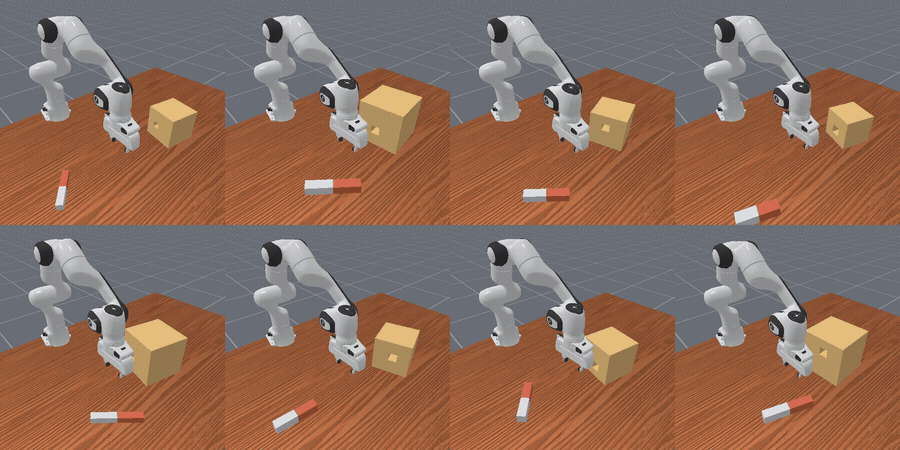

# robotics-world-models

Learned **world models for robotic manipulation** in simulation, benchmarked against
model-free RL and classical motion planning — with the sweep infrastructure wired
into [`autoresearch`](https://github.com/charleneleong-ai/autoresearch).

> **Honest positioning:** this is
> a *reproduction + controlled-comparison* study, not a new method. The defensible contribution is
> the **world-model-vs-classical crossover on contact-rich tasks** (PegInsertionSide), characterized
> with `rliable`-grade statistics. PickCube is the warm-up/sanity task.

## Demo — PegInsertionSide



_8 parallel `PegInsertionSide-v1` rollouts — the contact-rich peg-in-hole task that anchors the **world-model (TD-MPC2) vs model-free (PPO) vs classical-planner** comparison. ([full-res mp4](assets/peginsertion_rollout.mp4))_

## Status

- ✅ **PPO floor** — 5 seeds × 10M steps on `PickCube-v1` (state obs). `success_once = 1.0` (PickCube is trivial for PPO — the real signal is contact-rich PegInsertionSide).
- 🔄 **TD-MPC2 floor** — 5 seeds running through the sweep driver on the A100.
- ⏭️ Next: SAC floor · DreamerV3 (own JAX env) · classical OMPL/MoveIt baseline · move to **PegInsertionSide**.

Training runs on a datacenter **A100 80GB** (Ubuntu 22.04, CUDA 12, ManiSkill3 + SAPIEN); logged to W&B project `wm-manip`.

## Layout

| Path | What |
|---|---|
| `project1-world-models-manipulation-SOTA.md` | SOTA survey: sims, methods, repos, benchmarks (verified 2026-06) |
| `project2-3d4d-scene-representation-SOTA.md` | SOTA survey for the 3D/4D Gaussian-splatting project |
| `configs/schedules/*.yaml` | sweep recipes |
| `experiments/autoresearch.py` | **SweepRunner driver** — schedule-driven, GPU-gated, resumable, hang-triaged |
| `experiments/<tag>/<config>/results.jsonl` · `progress.png` | per-config results + chart |
| `experiments/test_driver.py` | local (no-GPU) tests for the driver + plumbing |
| `docs/experiments/<tag>/` | per-sweep writeups |

`benchmarks/ManiSkill` (the baseline scripts) is cloned on the training box, not vendored here.

## Commands (mise)

Analysis runs locally (Mac, against W&B); training runs on the A100 via SSH.

```bash
mise run init        # one-time local tooling venv (autoresearch[wandb] + pytest)
mise run test        # local no-GPU tests for the driver + SweepRunner plumbing
mise run dry-run     # plan the sweep — print commands, skip already-done, no launch
mise run deploy      # push driver + configs to the A100
mise run sweep       # launch the SweepRunner driver detached on the A100 (PPID=1)
mise run status      # A100 log tail + running procs + GPU
mise run pull        # pull A100 results.jsonl back for local render/report
mise run render ppo  # progress.png for a config
mise run report ppo  # writeup scaffold
```

## Setup

W&B auth via `.env` (copy `.env.example` → `.env`, gitignored). A100 bring-up is in
[`setup.sh`](setup.sh).
