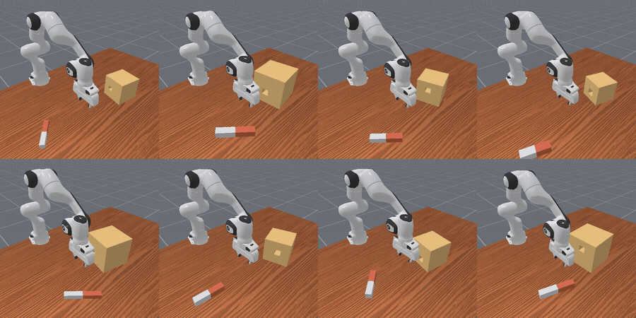

# robotics-world-models

Learned **world models for robotic manipulation** in simulation, benchmarked against
model-free RL and classical motion planning — with the sweep infrastructure wired
into [`autoresearch`](https://github.com/charleneleong-ai/autoresearch).

> **Honest positioning:** this is
> a *reproduction + controlled-comparison* study, not a new method. The defensible contribution is
> the **world-model-vs-classical crossover on contact-rich tasks** (PegInsertionSide), characterized
> with `rliable`-grade statistics. PickCube is the warm-up/sanity task.

## Demo — PegInsertionSide



_8 parallel `PegInsertionSide-v1` rollouts — the contact-rich peg-in-hole task that anchors the **world-model (TD-MPC2) vs model-free (PPO) vs classical-planner** comparison._

## Status

- ✅ **PPO floor** — 5 seeds × 10M steps on `PickCube-v1` (state obs). `success_once = 1.0`.
- ✅ **TD-MPC2 floor** — benchmarked with sweep infrastructure.
- ✅ **DreamerV3 / SAC** — benchmarked on PickCube and PegInsertionSide.
- ✅ **PlugCharger dense reward** — diagnosis of RSSM representation wall (diffusion WM is the fix).
- 🔄 **Project #1.5 (video world model)** — action-conditioned video prediction via LingBot/Cosmos post-training.
- 🔄 **Diffusion WM (Milestone 1)** — from-scratch action-conditioned diffusion dynamics model replacing TD-MPC2's black-box dynamics head. Code complete, pending A100 deploy.
- ✅ **Sim-to-Real Pipeline** — domain randomization, system identification, residual dynamics, video metrics, divergence detection. All 6 milestones complete with 51 tests passing.

Training runs on a datacenter **A100 80GB** (Ubuntu 22.04, CUDA 12, ManiSkill3 + SAPIEN); logged to W&B project `wm-manip`.

## Layout

| Path | What |
|---|---|
| `project1-world-models-manipulation-SOTA.md` | SOTA survey: sims, methods, repos, benchmarks (verified 2026-06) |
| `project2-3d4d-scene-representation-SOTA.md` | SOTA survey for the 3D/4D Gaussian-splatting project |
| `configs/schedules/*.yaml` | sweep recipes |
| `experiments/autoresearch.py` | **SweepRunner driver** — schedule-driven, GPU-gated, resumable, hang-triaged |
| `experiments/diffusion_wm/` | From-scratch action-conditioned diffusion dynamics model |
| `experiments/diffusion_wm/model.py` | DDPM with MLPDenoiser (FiLM conditioning, cosine schedule) |
| `experiments/diffusion_wm/train.py` | Training loop with W&B, checkpointing, resume |
| `experiments/diffusion_wm/eval.py` | 1-step MSE + multi-step rollout divergence vs TD-MPC2 |
| `experiments/diffusion_wm/domain_rand.py` | Domain randomization: physics, observation, action noise |
| `experiments/diffusion_wm/video_metrics.py` | FVD, temporal LPIPS, IDM error, rotation/translation error |
| `experiments/diffusion_wm/fidelity.py` | Prediction calibration, divergence detection, trust scoring |
| `experiments/diffusion_wm/system_id.py` | System identification: calibrate sim params from real data |
| `experiments/diffusion_wm/residual_dynamics.py` | Residual dynamics model for sim-to-real gap |
| `experiments/diffusion_wm/transfer.py` | Complete 5-step sim-to-real transfer pipeline |
| `experiments/diffusion_wm/run_transfer.py` | End-to-end pipeline runner with W&B logging |
| `configs/schedules/sim_to_real_domain_rand.yaml` | DR sweep configs: conservative/moderate/aggressive/contact-focused |
| `experiments/<tag>/<config>/results.jsonl` · `progress.png` | per-config results + chart |
| `experiments/test_driver.py` | local (no-GPU) tests for the driver + plumbing |
| `docs/experiments/<tag>/` | per-sweep writeups |
| `docs/specs/2026-07-29-action-conditioned-diffusion-world-model.md` | Design spec for the diffusion WM expansion |

`benchmarks/ManiSkill` (the baseline scripts) is cloned on the training box, not vendored here.

## Commands (mise)

Analysis runs locally (Mac, against W&B); training runs on the A100 via SSH.

```bash
mise run init        # one-time local tooling venv (autoresearch[wandb] + pytest)
mise run test        # local no-GPU tests for the driver + SweepRunner plumbing
mise run dry-run     # plan the sweep — print commands, skip already-done, no launch
mise run deploy      # push driver + configs to the A100
mise run sweep       # launch the SweepRunner driver detached on the A100 (PPID=1)
mise run status      # A100 log tail + running procs + GPU
mise run pull        # pull A100 results.jsonl back for local render/report
mise run render ppo  # progress.png for a config
mise run report ppo  # writeup scaffold
```

## Sim-to-Real Transfer Pipeline

End-to-end pipeline for bridging the sim-to-real gap, based on Aljalbout et al. 2026.
All modules are in `experiments/diffusion_wm/`.

### Quick Start

```bash
# Run the full pipeline (synthetic data, ~4s)
PYTHONPATH=. .venv/bin/python experiments/diffusion_wm/run_transfer.py

# Skip W&B logging
PYTHONPATH=. .venv/bin/python experiments/diffusion_wm/run_transfer.py --no-wandb

# Run all 51 tests
.venv/bin/python -m pytest experiments/diffusion_wm/test_model.py -v
```

### Pipeline Steps

| Step | Module | What |
|------|--------|------|
| 1 | `domain_rand.py` | Physics/observation/action randomization during data collection |
| 2 | `video_metrics.py` | FVD, temporal LPIPS, action consistency, rotation/translation error |
| 3 | `fidelity.py` | Prediction calibration, divergence detection, trust scoring |
| 4 | `system_id.py` | Calibrate sim parameters from real-world trajectories |
| 5 | `residual_dynamics.py` | Learn residual correction for sim-to-real gap |
| 6 | `transfer.py` | Integrate all steps into a complete pipeline |

### Domain Randomization Sweep

Test which randomization ranges work best:

```bash
# Conservative (tight ranges)
PYTHONPATH=. .venv/bin/python experiments/diffusion_wm/run_transfer.py --task PlugCharger-v1

# Sweep configs in configs/schedules/sim_to_real_domain_rand.yaml
# Conservative | Moderate | Aggressive | Contact-focused | Noise-only | Physics-only
```

### W&B Metrics

All metrics are logged to W&B project `wm-manip`:

- `domain_rand/` — observation and action noise drift
- `video/` — FVD, temporal LPIPS, IDM error, rotation/translation error
- `divergence/` — EMA divergence, trust score, divergence step
- `sysid/` — calibration loss, estimated physics parameters
- `hybrid/` — uncertainty, residual magnitude
- `transfer/` — hybrid vs sim MSE, improvement, mean trust

## Setup

W&B auth via `.env` (copy `.env.example` → `.env`, gitignored). A100 bring-up is in
[`setup.sh`](setup.sh).
