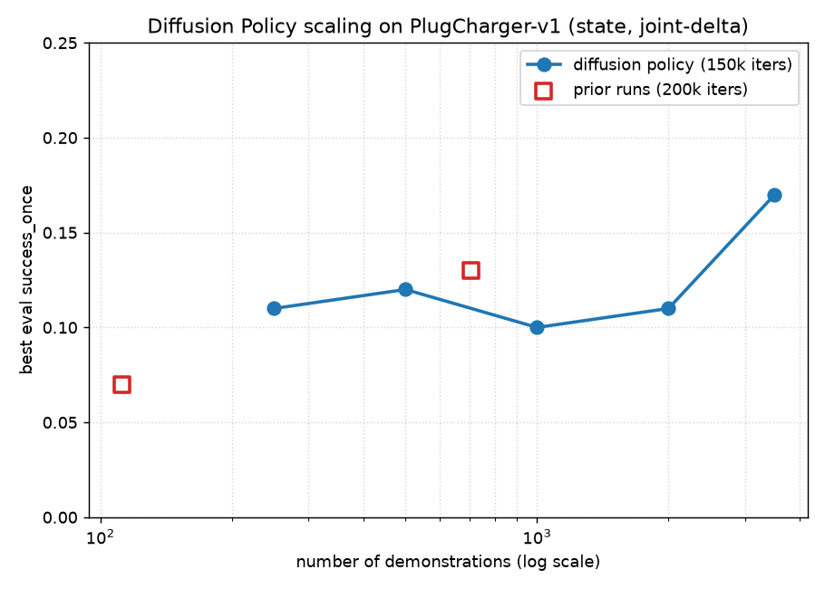

# PlugCharger — a paradigm study on extreme-precision insertion

**Status:** done (2026-07-11). PlugCharger's two-prong, sub-mm, sub-0.2-rad keyed insertion is where paradigms separate. Measured on one task, one budget, one sim: **classical (privileged) 0.56 · imitation (diffusion) 0.13–0.17 · model-based RL 0.00 · generative-WM RL — blocked upstream**. Success tracks how much prior knowledge each learned paradigm is handed: RL, which must *discover* the skill, categorically fails; imitation, which *copies* a demonstrator, is the only learned paradigm that inserts — and it scales with demos but plateaus below solve. The privileged classical planner leads yet itself degrades from its PegInsertion 0.75, confirming the task is genuinely harder — not just hard for RL.

## The result

| paradigm | prior knowledge | PlugCharger success | run |
|---|---|---|---|
| classical (mplib RRTConnect + screw) | full socket geometry + scripted contact | **0.56** (54/96 eps) | measured 2026-07-07 |
| **imitation** — diffusion policy, 3500 demos | learns from demonstrations | **0.17** once | scaling sweep (below) |
| imitation — diffusion policy, 706 demos | — | 0.13 once / 0.04 held | [`x02u1vli`](https://wandb.ai/chaleong/wm-manip/runs/x02u1vli) |
| imitation — ACT (action-chunking), 706 demos | — | 0.08 once | [`y9dwy9xe`](https://wandb.ai/chaleong/wm-manip/runs/y9dwy9xe) |
| model-based RL (TD-MPC2, every variant) | none / demos-as-signal | **0.00** | see null below |
| demo-bootstrapped RL (RLPD) | 112 demos, 50/50 sampling | **0.00** | [`qj3tp91t`](https://wandb.ai/chaleong/wm-manip/runs/qj3tp91t) |
| generative-WM RL (DreamerV3) | none | **n/a — stalls before insertion** | see below |

"n/a" for DreamerV3 is deliberate, not a 0: it fails stages (grasp, then place-and-hold) that precede insertion, so it never attempts the maneuver the study measures — unlike the RL 0.00, which *is* a genuine at-the-insertion failure (see the generative-WM section). Imitation is the only learned paradigm to insert at all; diffusion (0.13–0.17) beats action-chunking (0.08); RL never produced a single held insertion under any recipe.

## Imitation scales — but plateaus below solve
Diffusion-policy success vs demo count (fixed 150k-iter budget, best eval `success_once`):

| demos | 112 | 250 | 500 | 706 | 1000 | 2000 | 3500 |
|---|---|---|---|---|---|---|---|
| success | 0.07 | 0.11 | 0.12 | 0.13 | 0.10 | 0.11 | 0.17 |

A fast early gain (112→250: 0.07→0.11) then a **noisy plateau ~0.11–0.13**, with a modest 0.17 at 3500. **30× the demos moved success only 0.07→0.17** — sub-logarithmic, asymptoting well below the privileged 0.56. So *even imitation hits the task-difficulty wall*: more data partially cracks PlugCharger but won't solve it. This is the informative shape — imitation is the right *direction*, but the tolerance is hard for every paradigm.

## Why a dense reward at all
Stock `PlugCharger-v1` ships **sparse-only** (`SUPPORTED_REWARD_MODES = ["none", "sparse"]` — the authors deliberately excluded dense). With no shaping, TD-MPC2 gets zero signal until a chance success it never finds from scratch (observed: flat `R=0` for 6 h). To make the task RL-tractable we wrote a staged dense reward — [`experiments/envs/plugcharger_dense.py`](../../experiments/envs/plugcharger_dense.py) (`PlugChargerDense-v1`): reach → touch → grasp → insert, with an **angular** alignment term the round-peg PegInsertion reward never needed (success here requires `obj_to_goal_angle <= 0.2`).

## The reward-engineering arc (how RL was exhausted, honestly)
| ver | reward | outcome |
|---|---|---|
| **v1** | flat staged weights (reach 1 / grasp 1 / align 3 / seat 5) | **farmed** — R climbed 3.4 → 104 over 1M while eval success stayed 0. The seat term maxed in a non-success hover band; the policy banked intermediate reward instead of inserting. |
| **v2–v4** | completion-dominant: precursors → 0.1, one success-tracking term `1-tanh(8·dist+4·angle)`, **additive** success bonus (v3's overwrite-to-flat-25 killed the gradient inside the success region) | farm-proof; grazed success ~10× in noisy exploration but never held or reproduced it (eval 0). |
| **v5** | staged align-then-insert: goal-frame decomposition of the approach a single pose-distance term can't express; a replayed solver demo earns it monotonically to a peak at success | **the decisive negative** — the policy optimized it to `train/reward = 38.9` (vs v4's 17.2) while eval success stayed 0. A well-shaped reward, driven hard, still could not produce the terminal maneuver. |

The v1 → v5 progression is the real engineering content: a reward-hacking exploit diagnosed at the ~1M checkpoint and fixed with a farm-proof redesign, then a geometry-decomposed reward that a demo provably earns — and RL *still* can't convert it into a held insertion. So the null is **not a reward-shaping gap**.

## The exhaustive RL null
Every legitimate RL lever, each implemented, validated, run to a full 2M steps — **all eval success 0**:

| lever | eval success | note |
|---|---|---|
| dense reward v1–v5 | 0 | reward optimized (v5 R=38.9), never converted to a held insert |
| + demos, persistent buffer, 25% ratio (112) | 0 | DDPGfD-style; demos never dilute or evict |
| + **end-effector control** (`pd_ee_delta_pose`) | 0 | [`5wxtsj9f`](https://wandb.ai/chaleong/wm-manip/runs/5wxtsj9f): `success_at_end` flat 0; one lone `success_once`=0.25 blip at 1.7M, `return` 0→29 — grazes once, never holds. Rules out joint-space control as the bottleneck. |
| **RLPD** (demo-bootstrapped SAC, 50/50 demo sampling) | 0 | [`qj3tp91t`](https://wandb.ai/chaleong/wm-manip/runs/qj3tp91t): flat 0 across all 40 eval points, 50k→2M. The recipe *purpose-built* for demo-bootstrapped hard manipulation also fails. |

This spans **model-based, demo-augmented, and demo-bootstrapped RL, across two control spaces** — the RL null is not a TD-MPC2 quirk.

## Generative world model (DreamerV3) — integrated, fast, but blocked upstream of insertion
We added a *generative* world model (DreamerV3) as a fourth paradigm — the natural complement to TD-MPC2's *latent* WM. Two results, one positive and one an honest wall:

- **Engineering win — ~42× throughput.** A torch DreamerV3 (SheepRL) integrated on ManiSkill but was **launch-bound** (~6 policy-steps/s, 17% GPU util — a Python loop of thousands of tiny RSSM kernels). Porting to **JAX DreamerV3** (danijar's, XLA-fused) hit **~255 steps/s — ~42× faster**, measured even while the GPU was contended. The reusable path: ManiSkill runs on gymnasium 0.29.1 (no shim), wrapped through a native `embodied.Env` adapter. This makes generative-WM training on ManiSkill practical.
- **Honest wall — the reactive actor advances one stage per intervention, never the whole sequence.** On even trivial **PickCube**, DreamerV3 gets **0 success**. Instrumentation localized it precisely, and a demo intervention then sharpened it further:
  - *Cold start:* the world model learns cleanly and the actor sharpens (score ~8, entropy collapses), but **~97% of episodes never grasp the cube** (`is_grasped` ≈ 0.02). It converges to a *reach-and-hover* optimum of the dense reward and never closes the gripper. An EE-control fix didn't help — the bottleneck is upstream of control mode.
  - *Demo warm-start (prefill replay with full successful solver trajectories):* grasp is **unblocked** — `is_grasped` rises 0.02 → **0.81** (81% of episodes grasp), score 4×'s (7 → 27). But **success is still 0**: it now grasps and lifts, yet stalls at the next dense-reward plateau and never completes the terminal *place-and-static* condition. Critically, the demos were *complete* success trajectories, so the world model had the full place-and-hold sequence in replay — the reactive actor absorbed only the grasp portion.
  - *Persistent demo buffer (demos never evict, sampled at a fixed ratio every batch — to rule out the dilution hypothesis):* run to **6.2M steps**. Grasp holds at **0.84**, but success **stays exactly 0.00**. So it was never a demo-*availability* problem — full success trajectories present in every batch across 6.2M steps still do not induce sequence completion. The wall is the reactive policy, not demo retention.

**The diagnostic contrast that matters:** TD-MPC2 solves the *identical* env + reward (PickCube trivial, StackCube 1.0, PegInsertion 0.84). The difference is *how the action is chosen*: TD-MPC2's short-horizon **MPC planning** searches the grasp→lift→place *sequence* and completes it, whereas DreamerV3's amortized **imagination actor** climbs the shaped-reward gradient **one stage at a time** and settles at each local optimum — a demo warm-start unblocks the *targeted* stage (grasp) but the actor stalls at the next, even with full success demonstrations available. So the generative-WM ladder-comparison is blocked not by throughput or the world model — both work — but by **sequence completion in the reactive policy**. And it is *not* demo dilution: a persistent, non-evicting demo buffer sampled every batch across 6.2M steps leaves success at 0 while grasp holds at 0.84. Every demo-based lever was exhausted, which pointed to **planning-augmented action selection** (search the sequence, as TD-MPC2 does) as the hypothesized fix — so we built it and tested it. It did *not* fix it, and *why* is the deepest result of this arc (next).

## Follow-up — planning on the same world model does *not* rescue it (a coverage↔accuracy wall)

The pointed experiment ([spec](../specs/2026-07-13-dreamer-planning-action-selection.md)): hold the *same* trained DreamerV3 world model fixed and replace the reactive actor with **MPC planning** — an actor-seeded **CEM** (N=256, H=28, 2 iters) that searches action sequences through the RSSM latent rollout, scoring predicted return + leaf value. Building it inside danijar's jitted ninjax RSSM worked (planning runs at ~1.3 fps vs the reactive actor's ~230 — a ~170× cost). But planning did **not** complete the task: on the grasping world model it holds grasp (1.0) yet still reaches **0 success** (place 0.00–0.20) — the same terminal wall.

**The decisive diagnostic — why planning can't help.** Teacher-forcing a real solver *success* demo through the world model and reading its heads: in the region the actor visits (reach/grasp) the reward head is accurate (~0.35–0.48 vs true ~0.42–0.53), but at the demo's **placed and success states it predicts ~0.09 where the true reward is 0.59 then 1.0** — a ~10× under-prediction — and it predicts *decreasing* reward exactly where the true reward jumps to 1.0; the value head never spikes. The world model **never learned the success payoff exists**, because the stalling reactive actor never visits those states, so they are near-absent from the replay the world model trains on. (H=28 reaches success in ~15 steps from grasp, so horizon/search is ruled out.)

**The result — a coverage↔accuracy coupling.** CEM maximizing the world model's predicted reward cannot target — and *actively steers away from* — a payoff the model cannot see. So swapping the reactive actor for search cannot fix a terminal region the world model itself never learned to represent. The bottleneck is not the action-selection mechanism (reactive vs planning) but **world-model accuracy in policy-under-visited regions**: the policy's coverage determines the model's accuracy, which bounds what any planner can exploit. The fix would require getting success experience into the world model's *training* signal (demonstrations driving the reward/value learning, or reward-model correction near the goal), not a better planner.

## Follow-up 2 — value-aware model learning partially closes the wall

The section above pointed to a named fix — get success experience into the world model's *training* signal rather than fitting it by observation-dominated maximum likelihood (**value-aware / task-aware model learning**; cf. [objective mismatch](https://hf.co/papers/2002.04523), [HarmonyDream](https://hf.co/papers/2310.00344)). We applied two levers to the same DreamerV3 setup ([spec](../specs/2026-07-19-value-aware-model-learning.md)): **up-weight the reward loss** (10× + a per-frame weight `×(1 + 10·reward + 30·|Δreward|)` so the rare 0.59→1.0 success-jump frames dominate the reward gradient), and **oversample demo success transitions** in the world-model batches (50% ratio).

**The model moves toward seeing the payoff — but only halfway.** Re-running the diagnostic on the retrained world model, the reward head's prediction at the demo's success state rose **0.09 → 0.47 (~5×)**, and — critically — the gradient **flipped sign**: the baseline predicted *decreasing* reward into the success region (0.24→0.09, actively steering the planner *away*); the value-aware model holds ~0.47 through it. So the objective-mismatch diagnosis is confirmed and the wall is demonstrably **loss-addressable**. But the head still under-predicts the full 1.0 cliff — it smooths into a ~0.47 plateau — because success frames remain ~0.7% of batches (≈1 per demo episode); up-weighting lifts the prediction but cannot manufacture a sharp cliff from that little coverage. The value head stayed flat.

**Task success stays 0 — the cap has partly shifted to the policy.** Neither the actor (placed 0.035) nor the CEM planner reaches success, because the actor never learned to *place*: even a perfect reward head cannot help a policy that does not visit the placement→success maneuver.

**Verdict — necessary but not sufficient.** Value-aware model learning is directionally correct: it repairs the model's success-blindness ~halfway (a clean positive confirmation of the PR #10 mechanism), but PickCube success needs *both* a sharper reward-cliff model (terminal-frame oversampling / stronger weighting) *and* a policy that can place. This resolves the generative-WM thread as a **coupled model + policy problem** — the honest end state, with the two remaining levers identified rather than hand-waved.

## The controls that make it trustworthy
- **StackCube solved under the same EE control** → [`rs8q0kab`](https://wandb.ai/chaleong/wm-manip/runs/rs8q0kab) reaches **eval 1.0** (matching joint-control [`th868utn`](https://wandb.ai/chaleong/wm-manip/runs/th868utn)). So end-effector control is a *safe, general* lever that holds a solvable task — PlugCharger's flat 0 under it is a genuine task result, not a broken config.
- **Same algorithm, budget, compute, reward rigor** across the ladder → PickCube (trivial) → PegInsertion (0.84) → StackCube (1.0) → PlugCharger (0.0). The 0 is the task, not the implementation.

## Verdict
The value is the *shape* of the result: on extreme-precision keyed insertion, **paradigm success is ordered by prior knowledge and by how the action is chosen**. RL asked to *discover* the maneuver from reward fails categorically (every fixable cause ruled out: sparse→dense, farming→farm-proof, dilution→persistent buffer, joint→EE, from-scratch→RLPD). Imitation — handed demonstrations — is the only learned paradigm that inserts, and it *scales* but plateaus (~0.17) below the privileged 0.56. The generative-WM thread adds two honest results: a ~42× throughput engineering win, and a precise negative — a reactive imagination actor never acquires grasp where a planning agent (TD-MPC2) does. The clean, general takeaway: **for extreme-precision contact tasks, imitate a demonstrator — and if you must learn online, plan the action sequence; a reactive actor optimizing shaped reward will settle for the reachable local optimum.**
