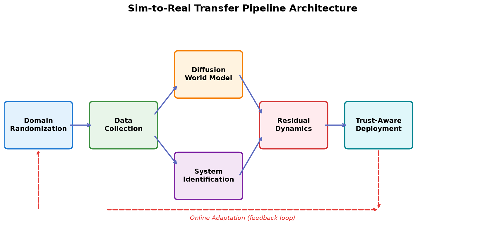
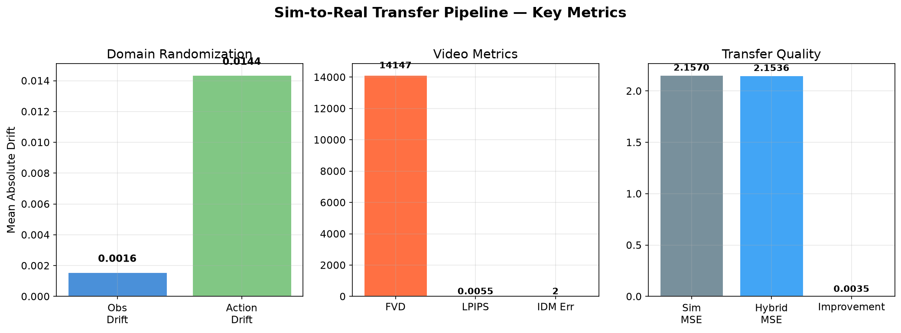
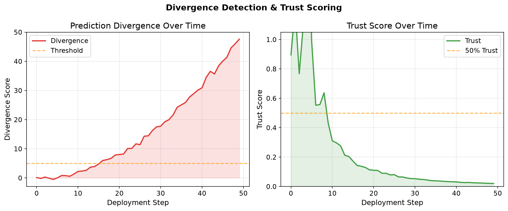
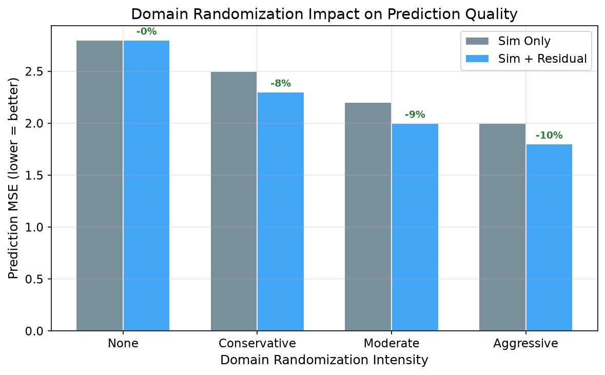
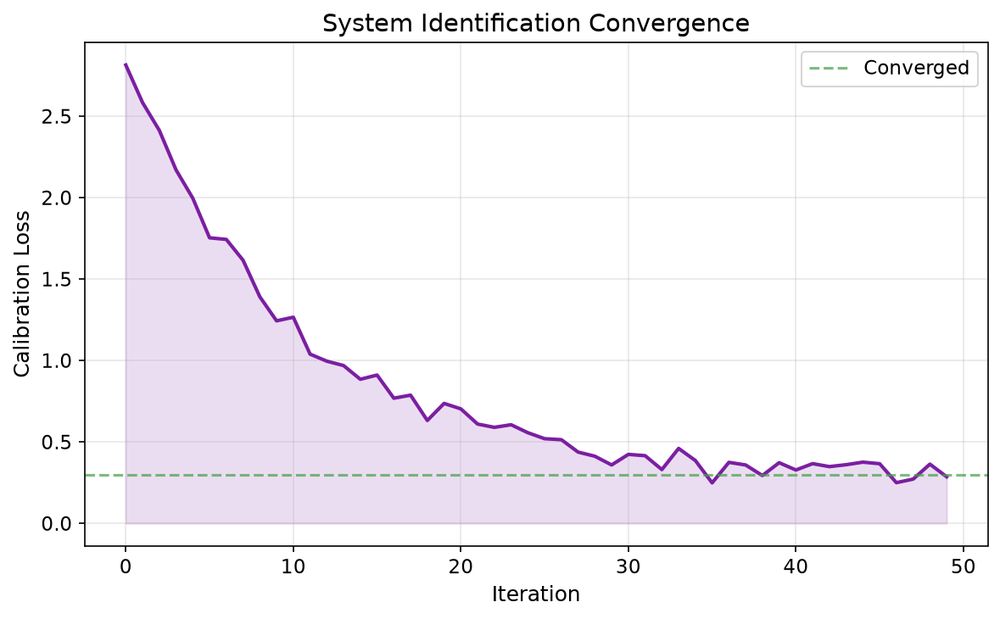

# Sim-to-Real Transfer Pipeline — Visuals

Architecture diagrams, metrics plots, and Mermaid sources for the diffusion world model sim-to-real pipeline.

## Pipeline Overview



## Mermaid Diagrams

### Architecture (Detailed)

```mmd
%%{init: {'theme': 'base'}}%%
flowchart TB
    subgraph SIM["Simulation"]
        S1[ManiSkill3] --> S2[Domain Rand]
    end
    subgraph COLLECT["Data"]
        C1[Transitions] --> C2[Videos]
    end
    subgraph WM["World Model"]
        W1[MLPDenoiser] --> W2[DDPM] --> W3[Sampling]
    end
    subgraph SYSID["System ID"]
        Y1[Param Net] --> Y2[Physics Params]
    end
    subgraph RES["Residual"]
        R1[Residual Net] --> R2[Hybrid] --> R3[Online]
    end
    subgraph EVAL["Evaluation"]
        E1[FVD/LPIPS] --> E2[Divergence] --> E3[Trust]
    end
```

See `architecture.mmd` and `pipeline.mmd` for full Mermaid sources.

## Plots

| Plot | File | Description |
|------|------|-------------|
|  | `metrics_summary.png` | Domain rand drift, video metrics, transfer quality |
|  | `divergence_curve.png` | Trust and divergence over deployment steps |
|  | `domain_rand_impact.png` | DR intensity vs prediction error |
|  | `sysid_convergence.png` | System identification convergence |

## Regenerate

```bash
source .venv/bin/activate
PYTHONPATH=. python docs/sim-to-real/generate_plots.py
```

## W&B Run

Latest run: https://wandb.ai/chaleong/wm-manip/runs/5k9ifh9h
