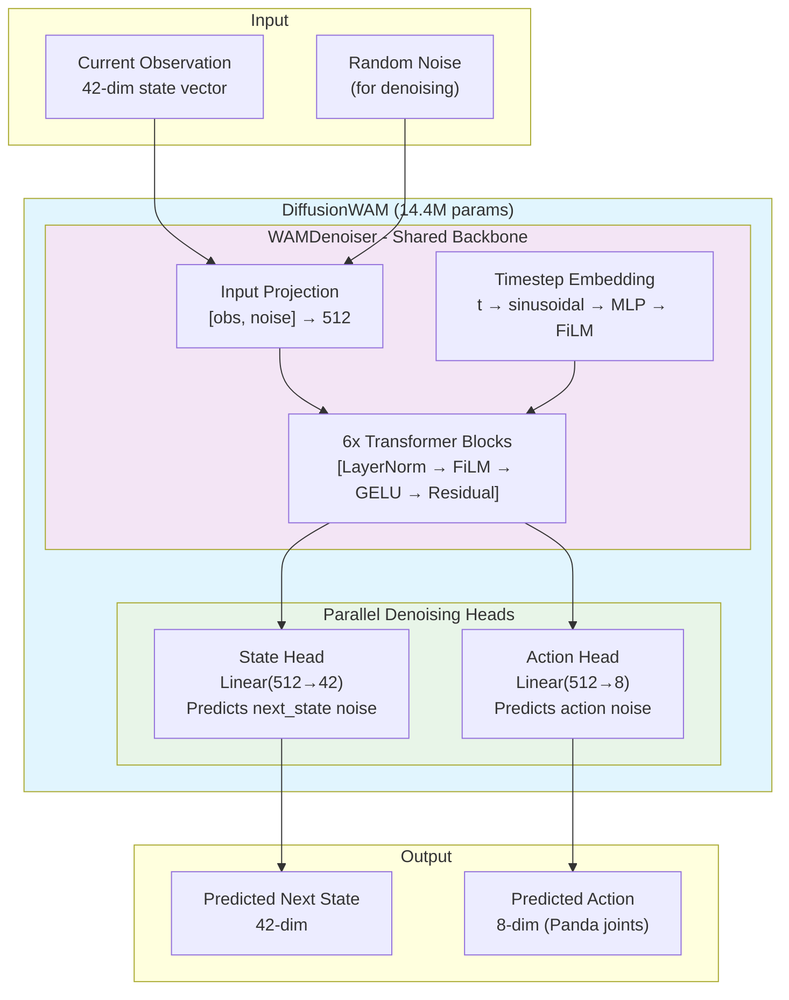
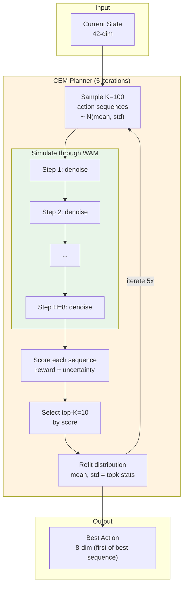
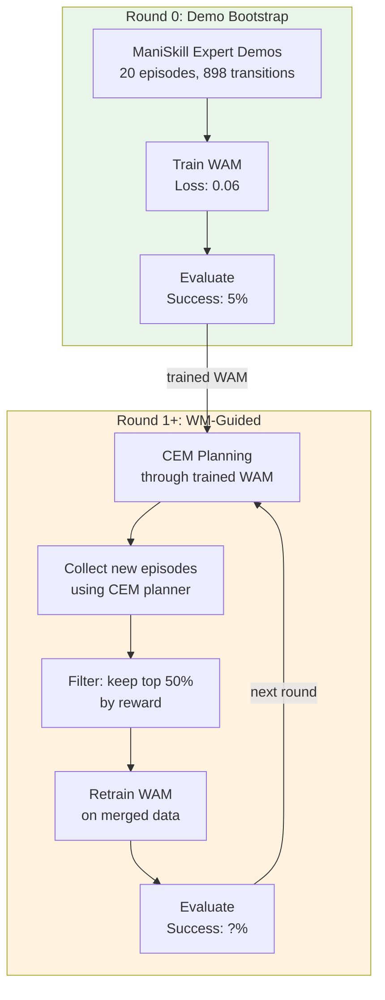
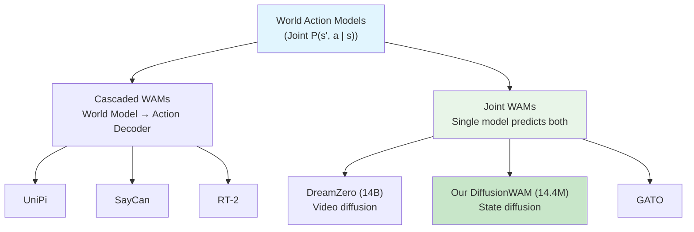

# WAM Architecture Diagrams (Mermaid)

## DiffusionWAM Architecture

```mermaid
graph TB
    subgraph Input
        obs["Current Observation<br/>42-dim state vector"]
        noise["Random Noise<br/>(for denoising)"]
    end

    subgraph DiffusionWAM["DiffusionWAM (14.4M params)"]
        subgraph WAMDenoiser["WAMDenoiser - Shared Backbone"]
            proj["Input Projection<br/>[obs, noise] → 512"]
            time["Timestep Embedding<br/>t → sinusoidal → MLP → FiLM"]
            blocks["6x Transformer Blocks<br/>[LayerNorm → FiLM → GELU → Residual]"]
        end

        subgraph Heads["Parallel Denoising Heads"]
            state_head["State Head<br/>Linear(512→42)<br/>Predicts next_state noise"]
            action_head["Action Head<br/>Linear(512→8)<br/>Predicts action noise"]
        end
    end

    subgraph Output
        next_state["Predicted Next State<br/>42-dim"]
        action["Predicted Action<br/>8-dim (Panda joints)"]
    end

    obs --> proj
    noise --> proj
    proj --> blocks
    time --> blocks
    blocks --> state_head
    blocks --> action_head
    state_head --> next_state
    action_head --> action

    style DiffusionWAM fill:#e1f5fe
    style WAMDenoiser fill:#f3e5f5
    style Heads fill:#e8f5e8
```

## CEM Planner

```mermaid
graph TB
    subgraph Input
        state["Current State<br/>42-dim"]
    end

    subgraph CEM["CEM Planner (5 iterations)"]
        sample["Sample K=100<br/>action sequences<br/>~ N(mean, std)"]
        
        subgraph Sim["Simulate through WAM"]
            sim1["Step 1: denoise"]
            sim2["Step 2: denoise"]
            sim3["..."]
            simH["Step H=8: denoise"]
        end
        
        score["Score each sequence<br/>reward + uncertainty"]
        topk["Select top-K=10<br/>by score"]
        refit["Refit distribution<br/>mean, std = topk stats"]
    end

    subgraph Output
        best_action["Best Action<br/>8-dim (first of best sequence)"]
    end

    state --> sample
    sample --> sim1
    sim1 --> sim2
    sim2 --> sim3
    sim3 --> simH
    simH --> score
    score --> topk
    topk --> refit
    refit --> |"iterate 5x"| sample
    refit --> best_action

    style CEM fill:#fff3e0
    style Sim fill:#e8f5e8
```

## Self-Driving Learning Loop

```mermaid
graph TB
    subgraph Round0["Round 0: Demo Bootstrap"]
        demos["ManiSkill Expert Demos<br/>20 episodes, 898 transitions"]
        train0["Train WAM<br/>Loss: 0.06"]
        eval0["Evaluate<br/>Success: 5%"]
    end

    subgraph Round1["Round 1+: WM-Guided"]
        cem["CEM Planning<br/>through trained WAM"]
        collect["Collect new episodes<br/>using CEM planner"]
        filter["Filter: keep top 50%<br/>by reward"]
        trainN["Retrain WAM<br/>on merged data"]
        evalN["Evaluate<br/>Success: ?%"]
    end

    demos --> train0
    train0 --> eval0
    eval0 --> |"trained WAM"| cem
    cem --> collect
    collect --> filter
    filter --> trainN
    trainN --> evalN
    evalN --> |"next round"| cem

    style Round0 fill:#e8f5e8
    style Round1 fill:#fff3e0
```

## WAM Taxonomy (from Wang et al. 2026)

```mermaid
graph TB
    WAM["World Action Models<br/>(Joint P(s', a | s))"]
    
    WAM --> Cascaded["Cascaded WAMs<br/>World Model → Action Decoder"]
    WAM --> Joint["Joint WAMs<br/>Single model predicts both"]
    
    Cascaded --> UniPi["UniPi"]
    Cascaded --> SayCan["SayCan"]
    Cascaded --> RT2["RT-2"]
    
    Joint --> DreamZero["DreamZero (14B)<br/>Video diffusion"]
    Joint --> DiffusionWAM["Our DiffusionWAM (14.4M)<br/>State diffusion"]
    Joint --> GATO["GATO"]

    style WAM fill:#e1f5fe
    style Joint fill:#e8f5e8
    style DiffusionWAM fill:#c8e6c9
```
