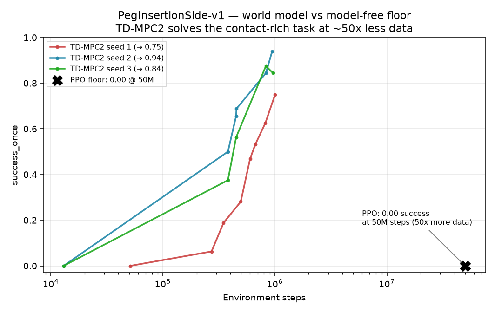

# PegInsertionSide-v1 — world model (TD-MPC2) vs model-free floor (PPO)

The contact-rich Project #1 headline: on `PegInsertionSide-v1` (state obs), the
**world model solves a task the model-free floor cannot touch, at ~50× less data.**

| method | metric | env steps | success_once |
|---|---|---|---|
| **TD-MPC2** (world model) | `train/success_once`, 3 seeds | **~1M** | **0.84 mean** (0.75 / 0.94 / 0.84) |
| PPO (model-free floor) | `eval/success_once`, 3 seeds | 50M | **0.00** |

TD-MPC2's `success_once` climbs steadily (0 → 0.5 by ~450k → 0.84 mean by ~1M and
still rising), while PPO never leaves 0.00 even at **50× the budget** (its tuned
budget is ~250M; capped at 50M here). This is the crossover PickCube cannot show —
PickCube is trivial (everything ceilings at 1.0); PegInsertionSide is where a learned
dynamics model + planning earns its keep. 

PickCube sanity check: TD-MPC2 also solves the easy task — `train/success_once` → **1.0**
by ~305k steps (run `512x9qh0`), confirming the pipeline before the hard task.

## Honest framing
- **Metric:** TD-MPC2 numbers are `train/success_once` (running success over training
  rollouts — the metric the ManiSkill TD-MPC2 baseline logs), not a separate held-out
  eval. PPO's 0.00 is `eval/success_once`. The train-vs-eval distinction doesn't change
  the qualitative result (0.84 vs 0.00), but a like-for-like eval pass is a follow-up.
- **Not converged:** all 3 TD-MPC2 seeds were **killed by the 12h wall-clock cap at
  ~1M steps** (2M target) — still climbing, so 0.84 is a *lower bound*. A longer cap
  (~24h) or more parallel envs gets the full curve to 2M.
- **Recovered, not re-run:** these numbers come straight from W&B
  (`chaleong/wm-manip`); the sweep's `results.jsonl` wrongly tagged the seeds
  `EARLY_KILL` because the result extractor watched `eval/success_once` (which TD-MPC2
  doesn't log) and the runs were SIGTERM'd before writing a finished summary. The
  *training data was always valid* — the harness reporting was not. Fix: extractor
  should read `train/success_once` for TD-MPC2 + a longer per-seed cap.
