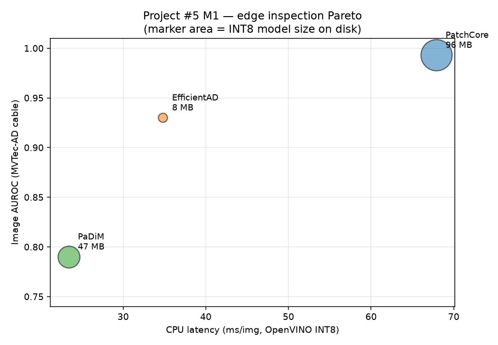
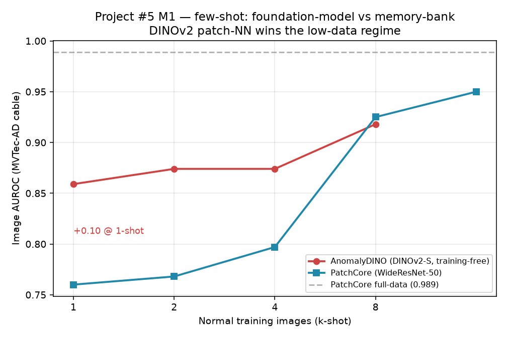

# Project #5 — Real-time Edge Vision-Inspection Foundation Model

> **Portfolio spec.** Solo, single-A100 (+ CPU/edge-proxy). Target cluster: **industrial / applied-CV** — **Matta** (London, manufacturing foundation models) and **Timescapes** (NZ, construction-site CV). Through-line both want: **big-model intelligence squeezed onto constrained hardware, in real time, with little data.**
>
> Research grounded against arXiv, GitHub, Hugging Face, and company sites on **2026-06-16**. Every repo/arxiv-ID/HF-ID/benchmark below was confirmed by direct fetch; values not anchored to a primary source are tagged **[UNVERIFIED]**. Licensing and hardware traps are flagged inline.

---

## 1. The pitch in one paragraph

Industrial visual inspection is the canonical "compress a foundation model onto factory hardware" problem: defects are rare, labels are scarce, the line runs in real time, and **there is no H100 in the factory** (Matta says this literally in their JD). The modern recipe is *unsupervised / few-shot* anomaly detection built on **self-supervised ViT patch features** (DINOv2/DINOv3), not supervised segmentation. This project takes a vision foundation model, **distills + quantizes it onto a constrained edge proxy**, runs **few-shot defect detection** on standard benchmarks (MVTec-AD / VisA), and reports an honest **accuracy ↔ latency ↔ compute Pareto curve** plus a **factory-to-factory few-shot transfer** result. It reuses the person's existing strengths (segmentation at scale, distillation, NF4 quantization, eval rigor, serving) and closes the named gaps (edge runtimes, QAT/pruning, anomaly-specific methods, hardware-aware latency).

---

## 2. Anomaly / defect detection — SOTA (the core task)

**Paradigm split to state up front.** Two families, different use cases:
- **Unsupervised feature/reconstruction** (PatchCore, EfficientAD, Dinomaly, INP-Former, GLASS): train on *normal-only* images per category → ~99.6–99.9% image-AUROC. Needs a small set of good parts.
- **CLIP/VLM zero-/few-shot generalists** (WinCLIP, AnomalyCLIP, AdaCLIP, April-GAN): *no per-category training* → ~85–93%. The data-efficient cold-start path.
- **DINO-patch few-shot** (AnomalyDINO): training-free nearest-neighbor on DINOv2 patch features → **96.6% MVTec from ONE reference image**. The current sweet spot for "little data."

### 2.1 Core methods

| Method | arXiv | Repo (maintained?) | MVTec img-AUROC | pixel-AUROC | Speed | Few-shot? | Notes |
|---|---|---|---|---|---|---|---|
| **EfficientAD** (S/M) | [2303.14535](https://arxiv.org/abs/2303.14535) | [nelson1425/EfficientAD](https://github.com/nelson1425/EfficientAD) (unofficial, stale 2023) | ~98.8% [UNVERIFIED]; cross-dataset mean 95.4–96.0% | AU-PRO 91–93 | **~2.2 ms (S) / 4.5 ms (M)** per img, RTX A6000 | No | The millisecond-latency reference. Only maintained via anomalib. |
| **PatchCore** | [2106.08265](https://arxiv.org/abs/2106.08265) | [amazon-science/patchcore-inspection](https://github.com/amazon-science/patchcore-inspection) (stale 2023) | **99.6%** | **98.4%** | ~0.17 s/256² @1% coreset | **Yes** (1-shot 83.4% per WinCLIP paper; tuned variants stronger) | Training-free memory bank + coreset. Canonical baseline. |
| **PaDiM** | [2011.08785](https://arxiv.org/abs/2011.08785) | [taikiinoue45/PaDiM](https://github.com/taikiinoue45/PaDiM) (stale 2021) | 97.9% | 97.5% | Fast, no training | Partial | Per-patch Gaussian. Lightweight. |
| **FastFlow** | [2111.07677](https://arxiv.org/abs/2111.07677) | [gathierry/FastFlow](https://github.com/gathierry/FastFlow) (stale 2023) | 99.4% | ~98.5% [UNVERIFIED] | "High efficiency" (no ms) | No | 2D normalizing-flow head. |
| **Dinomaly** | [2405.14325](https://arxiv.org/abs/2405.14325) (CVPR 2025) | [guojiajeremy/Dinomaly](https://github.com/guojiajeremy/Dinomaly) (~478★, **active**) | **99.6%** (ViT-B) | 98.8% | Single ViT fwd pass [UNVERIFIED FPS] | Dinomaly2 adds few-shot | **First multi-class unified model matching single-class SOTA.** DINOv2-ViT reconstruction. Trains on a 24 GB 3090. Now in anomalib. Dinomaly2: [2510.17611](https://arxiv.org/abs/2510.17611). |

### 2.2 VLM zero-/few-shot generalists

| Method | arXiv | Repo | MVTec (img/px) | VisA (img/px) | Shots | Notes |
|---|---|---|---|---|---|---|
| **WinCLIP / WinCLIP+** | [2303.14814](https://arxiv.org/abs/2303.14814) (CVPR 2023) | 3rd-party / anomalib | 91.8/85.1 (ZS); 93.1/95.2 (1-shot) | 78.1/79.6; 83.8/96.4 | 0, 1, 2, 4 | Training-free window-based CLIP. |
| **AnomalyCLIP** | [2310.18961](https://arxiv.org/abs/2310.18961) (ICLR 2024) | [zqhang/AnomalyCLIP](https://github.com/zqhang/AnomalyCLIP) (partial) | 91.5/91.1 (ZS) | 82.1/95.5 | 0 | Object-agnostic prompts → **best cold-start** (0 target images), cross-domain. |
| **AdaCLIP** | [2407.15795](https://arxiv.org/abs/2407.15795) (ECCV 2024) | [caoyunkang/AdaCLIP](https://github.com/caoyunkang/AdaCLIP) | 90.0 (ZS) [UNVERIFIED px] | 84.3/95.5 | 0 | **Zero-shot, NOT few-shot** (brief mislabeled it). Hybrid static+dynamic prompts. |
| **April-GAN / VAND** | [2305.17382](https://arxiv.org/abs/2305.17382) | [ByChelsea/VAND-APRIL-GAN](https://github.com/ByChelsea/VAND-APRIL-GAN) | F1-only in abstract [UNVERIFIED AUROC] | — | 0, 1, 2, 4 | 1st ZS / 4th few-shot at VAND 2023. Successor [CLIP-AD](https://github.com/ByChelsea/CLIP-AD). |
| **PromptAD** | [2404.05231](https://arxiv.org/abs/2404.05231) (CVPR 2024) | — | 94.6→95.7→96.6 (1/2/4-shot; px ~96-97) | 86.9→88.3→89.1 | 1, 2, 4 | Learns prompts from **normal-only** samples. Best *verified* few-shot localization. |
| **AnomalyDINO** | [2405.14529](https://arxiv.org/abs/2405.14529) (WACV 2025 oral) | (DINOv2-based) | **96.6% (1-shot)** | tables only | 1 | **Training-free DINOv2 patch NN. No text, no aux data. The recommended core.** |

### 2.3 2025–2026 successors (the newest to know)

| Method | arXiv | Repo | MVTec img-AUROC | Few-shot? | Notes |
|---|---|---|---|---|---|
| **INP-Former / ++** | [2503.02424](https://arxiv.org/abs/2503.02424) / [2506.03660](https://arxiv.org/abs/2506.03660) (CVPR 2025) | [luow23/INP-Former](https://github.com/luow23/INP-Former) | **99.7%** (99.8% ++) | **Yes** (single/multi/few/some zero) | Extracts intrinsic normal prototypes from a *single test image*. In anomalib v2.5.0. |
| **GLASS** | [2407.09359](https://arxiv.org/abs/2407.09359) (ECCV 2024) | [cqylunlun/GLASS](https://github.com/cqylunlun/GLASS) | **99.9%** | No | Anomaly synthesis via gradient ascent; strongest single-class. In anomalib. |
| **UniNet** | ID [UNVERIFIED] ([project](https://pangdatangtt.github.io)) | [pangdatangtt/UniNet](https://github.com/pangdatangtt/UniNet) | ~99.5% [UNVERIFIED] | No | Contrastive unified framework. In anomalib. |
| **AnomalyVFM** | [2601.20524](https://arxiv.org/html/2601.20524v1) (CVPR 2026) | in anomalib v2.5.0 as `anomalyvfm` | 94.1% avg/9 datasets [UNVERIFIED MVTec] | Zero-shot | **Turns VFMs into ZS detectors — the genuine "ViT/foundation-model" story in anomalib** (other classic models are CNN-backboned). |
| **ResAD / ResAD++** | [2410.20047](https://arxiv.org/abs/2410.20047) (NeurIPS 2024 spotlight) / [2509.23741](https://arxiv.org/abs/2509.23741) | — | 85.6→90.5 (2/4-shot) | **Yes, class-generalizable** | One model, new classes/domains, **no retrain** — the factory-to-factory transfer story. Non-CLIP. |
| **InCTRL / v2** | [2403.06495](https://arxiv.org/abs/2403.06495) / [2604.04632](https://arxiv.org/abs/2604.04632) | — | v2: 92.2→94.0→94.5 (1/2/4) | **Yes, generalist** | In-context residual learning, no target retraining. |

### 2.4 anomalib — the umbrella library (use this)

- **Repo:** [github.com/open-edge-platform/anomalib](https://github.com/open-edge-platform/anomalib) (~5.8k★, **Apache-2.0, very active**). Old `openvinotoolkit/anomalib` redirects here.
- **Current: v2.5.0** (2026-05-29) — added INP-Former, GLASS, AnomalyVFM, CFM.
- **OpenVINO IR export: yes** (also Torch/ONNX) — the direct edge path. `anomalib[openvino]`.
- **Models (29 image + video):** ships EfficientAD, PatchCore, PaDiM, FastFlow, Dinomaly, INP-Former, GLASS, UniNet, AnomalyVFM, WinCLIP, AnomalyDINO, vlm_ad, and more.
- **Why it matters:** the *single fastest path* to reproduce nearly the entire table on one A100, unified Lightning API, built-in MVTec/VisA/LOCO/Real-IAD loaders, benchmarking + export tooling, single-GPU out of the box. **All canonical method repos (EfficientAD/PatchCore/PaDiM/FastFlow) are stale (2021–2023); anomalib is the only maintained path.**

> **Corrections to the brief, flagged:** (a) **AdaCLIP is zero-shot, not few-shot** — the few-shot VLMs are WinCLIP+, April-GAN, PromptAD. (b) **No discrete "2025 EfficientAD successor"** — the field moved to *harder benchmarks* (MVTec-AD 2 / VAND 3.0) where EfficientAD drops >10pp AU-PRO under realistic lighting while PatchCore/RD stay robust ([2509.17615](https://arxiv.org/html/2509.17615v1)) — cite this for an edge-realism argument. (c) **PatchCore uses WideResNet-50, not DINOv2** — DINOv2 is the native backbone of Dinomaly/AnomalyDINO and a drop-in PatchCore backbone replacement; phrase accordingly. (d) **Dinomaly 99.6% is full-training multi-class, not few-shot** — don't quote it as a data-efficient number.

---

## 3. Benchmarks & metrics

### 3.1 Licensing traps — READ FIRST

| Dataset | License | Commercial? |
|---|---|---|
| **MVTec-AD / LOCO / AD 2** | CC BY-NC-SA 4.0 | ❌ **NO — research-only.** "not allowed for commercial purposes." |
| **Real-IAD** | CC BY-NC-SA 4.0 (HF gated terms binding) | ❌ **NO — research-only.** ⚠️ Project site says CC BY-SA, but the gated HF download requires CC BY-**NC**-SA. Treat as non-commercial. |
| **VisA** | CC BY 4.0 | ✅ **YES** — commercial OK (attribution). Some mirrors mislabel it NC; official Amazon repo + AWS Open Data say CC BY 4.0. |
| **M2AD** (2025) | Apache 2.0 | ✅ **YES** — fully permissive, not gated. |

**Bottom line:** only **VisA** and **M2AD** are safe if the artifact must be redistributable/commercial. For a non-commercialized portfolio, all are usable with attribution. **Lead with VisA + MVTec-AD** (universal baselines), add **MVTec-LOCO** for logical anomalies and **M2AD/Real-IAD** for a "modern/hard" angle.

### 3.2 Benchmark table

| Dataset | URL | #cats | #imgs | Distinctive | License | Solo-DL? |
|---|---|---|---|---|---|---|
| **MVTec-AD** (2019) | [mvtec.com](https://www.mvtec.com/company/research/datasets/mvtec-ad) | 15 | >5,000 | The de-facto standard; pixel masks; normal-only training | CC BY-NC-SA | ✅ form |
| **VisA** (2022) | [arxiv 2207.14315](https://arxiv.org/abs/2207.14315) · [AWS](https://registry.opendata.aws/visa/) | 12 | 10,821 | Larger/varied; multi-instance, complex PCB; ~8-10pp harder than MVTec | **CC BY 4.0** | ✅ direct S3 `wget` |
| **MVTec-LOCO** (2022) | [mvtec.com](https://www.mvtec.com/company/research/datasets/mvtec-loco-ad) | 5 | 3,644 | **Logical anomalies** (wrong place/count/missing) — needs global reasoning | CC BY-NC-SA | ✅ form |
| **Real-IAD** (CVPR 2024) | [arxiv 2403.12580](https://arxiv.org/abs/2403.12580) · [HF](https://huggingface.co/datasets/Real-IAD/Real-IAD) | 30 | ~150K | 5 views/object [UNVERIFIED count]; much harder (SOTA much lower) | CC BY-NC-SA (gated) | ✅ HF gated |
| **MVTec-AD 2** (2025) | [mvtec.com](https://www.mvtec.com/company/research/datasets/mvtec-ad-2) · [arxiv 2503.21622](https://ui.adsabs.harvard.edu/abs/2025arXiv250321622H/abstract) · [eval server](https://benchmark.mvtec.com) | 8 | >8,000 | Built to de-saturate; transparent/overlapping objects, backlight, unseen test lighting; **SOTA still <60% AU-PRO**; private test via eval server | CC BY-NC-SA | ✅ form (private test scored online) |
| **M2AD** (2025, newest) | [arxiv 2505.10996](https://arxiv.org/abs/2505.10996) · [HF](https://huggingface.co/datasets/ChengYuQi99/M2AD) | 10 | 119,880 | 12 views × 10 illuminations (120 configs); ultra-high-res; two protocols (Synergy/Invariant) | **Apache 2.0** | ✅ open HF |

> **Yes, MVTec-AD 2 is real and released** (IJCV vol. 134, arxiv 2503.21622). [UNVERIFIED]: Real-IAD's exact 99,721/51,329 split and "5 views" not in the fetched abstract — confirm in paper body before quoting.

### 3.3 Metrics — precise definitions

- **Image-level AUROC** — each *image* one sample (score = aggregate over map); measures **detection**. Threshold-independent.
- **Pixel-level AUROC** — each *pixel* a sample; measures **localization**. ⚠️ Inflated on tiny defects (normal-pixel majority) — prefer PRO for localization.
- **AP (Average Precision)** — area under precision–recall; better than AUROC under heavy pixel imbalance.
- **PRO (Per-Region Overlap)** — at a threshold, average relative overlap with **each connected GT region separately**: `PRO = (1/K) Σₖ |P∩Cₖ|/|Cₖ|`. **Weights every region equally regardless of size** — a missed small defect costs as much as a large one.
- **AUPRO / AU-PRO₀.₃** — area under PRO-vs-FPR, integrated over **FPR 0→0.3** (only the low-false-alarm regime matters industrially). The standard MVTec localization metric.
- **F1-max** — max F1 over thresholds; best balanced operating point. Common on VisA.

---

## 4. VFM backbones to distill/quantize for edge

**Key insight:** for *dense* anomaly detection, **DINO patch features are the right currency** — Dinomaly, AnomalyDINO, INP-Former all consume them, and they survive distillation well. CLIP gives image-level semantics (good for zero-shot) but weak dense features. SAM-family segments but isn't a general AD feature space.

| Model | Release | Repo / HF | Smallest params | Edge/distilled variant? | Notes |
|---|---|---|---|---|---|
| **DINOv2** | [2304.07193](https://arxiv.org/abs/2304.07193) | [dinov2](https://github.com/facebookresearch/dinov2) · [`facebook/dinov2-small`](https://hf.co/facebook/dinov2-small) | **ViT-S/14 ~22M** | S/B/L *are* distilled from ViT-g (1.1B) | **Apache-2.0.** Patch features → basis of Dinomaly/AnomalyDINO. **Best AD fit, cleanest license.** |
| **DINOv2 + registers** | [2309.16588](https://arxiv.org/abs/2309.16588) | [`...with-registers-small`](https://hf.co/facebook/dinov2-with-registers-small) | ~22M | same | Removes dense-feature artifacts → **cleaner patch features. Prefer over vanilla.** |
| **DINOv3** | **[2508.10104](https://arxiv.org/abs/2508.10104)** (Aug 2025, **CONFIRMED REAL**) | [dinov3](https://github.com/facebookresearch/dinov3) · [`dinov3-vits16`](https://huggingface.co/facebook/dinov3-vits16-pretrain-lvd1689m) · [`convnext-tiny`](https://huggingface.co/facebook/dinov3-convnext-tiny-pretrain-lvd1689m) | **ViT-S/16 21M**; ConvNeXt-Tiny 29M | full distilled S/S+/B/L/H+ from 7B teacher + ConvNeXt-Tiny CNN | **Gated "DINOv3 License"** (commercial-friendly, accept terms). Gram Anchoring → best patch features. **The 2026 backbone of record.** ConvNeXt-Tiny quantizes cleaner (no softmax INT8 pain) — good NPU fallback. |
| **SAM 2** | [2408.00714](https://arxiv.org/abs/2408.00714) | [sam2](https://github.com/facebookresearch/sam2) · [`sam2.1-hiera-tiny`](https://huggingface.co/facebook/sam2-hiera-tiny) | hiera-tiny ~39M | EdgeTAM is Meta's edge answer | Apache-2.0. **Segmentation, not a general AD backbone** — use only for ROI masking of parts before AD. |
| **MobileSAM** | [2306.14289](https://arxiv.org/abs/2306.14289) | [MobileSAM](https://github.com/ChaoningZhang/MobileSAM) | **~9.7M** | *is* the distilled edge SAM | MIT. ~10–12 ms/img GPU. Decoupled distillation SAM-ViT-H → TinyViT. Most-ported (ONNX/CoreML/Qualcomm). |
| **EdgeSAM** | [2312.06660](https://arxiv.org/abs/2312.06660) | [EdgeSAM](https://github.com/chongzhou96/EdgeSAM) | **~9.6M** | *is* the distilled edge SAM | MIT. ~40× faster than SAM, **38.7 FPS iPhone 14**. Prompt-in-the-loop distillation (ViT→CNN). |
| **TinyViT** | [2207.10666](https://arxiv.org/abs/2207.10666) | [TinyViT](https://github.com/microsoft/Cream/tree/main/TinyViT) · [`timm/tiny_vit_5m`](https://huggingface.co/timm/tiny_vit_5m_224.dist_in22k_ft_in1k) | **5.4M** | student arch (powers MobileSAM) | MIT. **Strong student backbone choice.** |
| **MobileViT** | [2110.02178](https://arxiv.org/abs/2110.02178) | [`apple/mobilevit-xx-small`](https://huggingface.co/apple/mobilevit-xx-small) | **XXS 1.3M** | student/edge arch | Hybrid CNN+ViT. Smallest viable student. |
| **EfficientViT (MIT)** | [2205.14756](https://arxiv.org/abs/2205.14756) | [mit-han-lab/efficientvit](https://github.com/mit-han-lab/efficientvit) | B1 9.1M (**24.8 ms Jetson Nano**) | edge arch | Linear attention, dense-prediction focus. **Published Jetson latency** — useful if you want a real edge number. ⚠️ Don't conflate with MSRA EfficientViT ([2305.07027](https://arxiv.org/abs/2305.07027)). |
| **TinyCLIP** | [2309.12314](https://arxiv.org/abs/2309.12314) | [`wkcn/TinyCLIP-ViT-8M`](https://huggingface.co/wkcn/TinyCLIP-ViT-8M-16-Text-3M-YFCC15M) | ViT-8M (~11M) | *is* distilled CLIP | MIT. Smallest permissive tiny CLIP (if you want a zero-shot branch). |

**Distillation recipes (2025-26, solo-feasible):**
- **Proteus** ([ICLR 2025](https://openreview.net/forum?id=LC6ZtQV6u2)) — distills DINOv2 into smaller students on **ImageNet-1K only, no original data**; introduces Proteus-Tiny. **The most directly relevant blueprint.**
- **CosPress** ([2411.15239](https://arxiv.org/html/2411.15239)) — angle-preserving feature distillation; better at retaining DINO feature *geometry* (which AD distances depend on).

**License caveats for "production":** DINOv2 Apache-2.0 (clean); DINOv3 gated commercial-friendly; **avoid MetaCLIP (CC-BY-NC)** and **MobileCLIP (apple-amlr research-only)** as production backbones. Student archs (TinyViT/MobileViT) are MIT.

> ### Recommended backbone path
> **Teacher:** DINOv2-with-registers ViT-S (22M, Apache-2.0) — or DINOv3 ViT-S/16 (21M) if the gated license is acceptable. **Student:** TinyViT-5M (proven SAM student) via **Proteus-style feature distillation on ImageNet-1K**, then INT8. **CNN fallback:** DINOv3-ConvNeXt-Tiny (29M) if the edge target lacks good transformer kernels. Evaluate frozen patch features with an **AnomalyDINO/Dinomaly-style head** on MVTec/VisA. Fully solo: single GPU, public data, public teacher.

---

## 5. Compression — what's solo-feasible and the trade-offs

> **Framing reality (carry through the spec):** the A100 is the *training / distillation / QAT* box, **not the deployment target**. "Real-time on edge" must be validated on the edge SKU or a credible proxy (§6). The A100 says almost nothing about edge latency.

| Technique | Size ↓ | Edge latency win | ViT accuracy drop | Tool | Solo 1-2 wk? |
|---|---|---|---|---|---|
| **Distillation** | 10-20× params | Large | low single-digit % | DINOv3 tiny, HF DeiT-w/-teacher, [lightly-train](https://github.com/lightly-ai/lightly-train) | **YES** (fine-tune pre-distilled); from-scratch = NO |
| **PTQ INT8** | ~4× | ~2-4× (INT8 cores) | 0.5-2% **if ViT-aware**; 5-10%+/no-op if naïve | [NV Model Optimizer](https://github.com/NVIDIA/TensorRT-Model-Optimizer), ORT, OpenVINO/NNCF | **YES, w/ caveat** |
| **QAT** | ~4×/8× | = PTQ, recovered | <1% INT8; makes INT4 viable | [torchao](https://github.com/pytorch/ao), NV Model Opt | **CONDITIONAL** — only if PTQ gap too big |
| **Token Merging (ToMe)** | fewer tokens | **~2× throughput** | 0.3-2%, recoverable | [ToMe](https://github.com/facebookresearch/ToMe) (archived Jan 2025 → fork) | **YES — easiest high-ROI win** |
| **2:4 sparsity** | ~2× wts | **~6% only** (ViT-L) | needs fine-tune | [torchao](https://github.com/pytorch/ao) | CONDITIONAL — low payoff, skip |
| **Unstructured pruning** | sparse only | **~none** (no sparse kernels) | varies | `torch.nn.utils.prune` | **NOT WORTH IT** |
| **NF4 (bitsandbytes)** | ~4× *memory* | **none/negative** | — | [bitsandbytes](https://github.com/bitsandbytes-foundation/bitsandbytes) | tech. yes but **WRONG TOOL — reject** |

**ViT quantization honesty (state this — it shows judgment):** ViTs are genuinely harder to quantize than CNNs (LayerNorm / post-GELU / post-Softmax activation outliers break uniform INT8). Stock **TensorRT INT8 has been observed to silently no-op on a ViT**, while a ViT-aware quantizer cut ~30% latency at 0.7% accuracy drop ([SqueezeBits](https://blog.squeezebits.com/how-to-quantize-transformerbased-model-for-tensorrt-deployment-55802)). **Use a ViT-aware toolchain** (ADFQ-ViT [2407.02763](https://arxiv.org/pdf/2407.02763), DopQ-ViT, NNCF, NV Model Optimizer), not naïve PTQ. Budget time for the "naïve failed → ViT-aware" iteration.

**Reject NF4 explicitly (the person's NF4-on-28B-video story does NOT transfer):** NF4 buys *memory, not speed* — GPUs lack native INT4 matmul, so NF4 weights are dequantized to FP16 every forward pass ([fast-dequant-kernel paper exists because of this](https://arxiv.org/pdf/2604.02556)). An edge ViT is already tiny → no VRAM crisis, no latency win, wrong runtime target. **One sentence rejecting it = demonstrated judgment.** (The transferable skill is the *quantization muscle*, not NF4 specifically.)

> **Recommended 2-week compression stack (priority order):** ① distill from a pre-distilled tiny DINOv2/v3 → ② ToMe (~2× free throughput) → ③ ViT-aware INT8 PTQ, validated on edge HW. **QAT only if the PTQ gap is unacceptable.** Skip pruning.

---

## 6. Edge runtimes + the honest "no Jetson" proxy story

### 6.1 Runtimes

| Runtime | Target | Conversion | INT8 | Maturity | Solo-friendly |
|---|---|---|---|---|---|
| **TensorRT 11.0** | NVIDIA GPU/Jetson | ONNX → engine | calib / explicit Q/DQ (**implicit removed in v11** — old tutorials stale) | Very mature | Good *if NVIDIA* |
| **ONNX Runtime 1.22/1.23** | CPU/NVIDIA/Intel/Arm | model → ONNX, **swap EP** | dyn + static | Very mature | **Highest** — prototype on CPU, flip to TRT/OpenVINO by changing one string |
| **OpenVINO 2026 + anomalib 2.5** | Intel CPU/iGPU/NPU | → OpenVINO IR (anomalib direct) | NNCF `nncf.quantize()` (POT removed) | Mature | **Best for this project** |
| **LiteRT (ex-TFLite)** | mobile/MCU | PyTorch/TF/JAX → `.tflite` | PTQ+QAT | Mature (mobile) | Good *if mobile* — weak for x86 factory PC |
| **ExecuTorch 1.0** | mobile/embedded/Arm Ethos | `torch.export` → `.pte` | PTQ/QAT | **1.0 GA Oct 2025**; Intel x86 backend *beta* | Arm/Qualcomm/Apple OK; **x86 risky** |

- **OpenVINO + anomalib is the production path for this project:** train on "good" parts only (unsupervised/few-shot, no labeled defect set), export to OpenVINO INT8, run on a cheap Intel CPU/NPU mini-PC — which **is** a real factory-inspection target.
- **Jetson:** Orin Nano/NX/AGX dominant; JetPack 7.2 (Jun 2026, CUDA 13); runs TensorRT natively.
- **NOT solo-feasible / over-scope:** custom Arm Ethos-U MCU bring-up, bespoke TensorRT plugins for unsupported ViT ops, immature multi-vendor NPU toolchains (MediaTek/Exynos/NXP). Survey for breadth; don't claim.

### 6.2 The honest edge proxy (the person likely has NO Jetson, NO factory line)

Build a **3-tier accuracy-vs-latency-vs-compute curve, no factory or NPU required:**

| Tier | What | Cost | Credibility |
|---|---|---|---|
| **1. Hardware-agnostic** | params + FLOPs ([fvcore](https://github.com/facebookresearch/fvcore)/[ptflops](https://github.com/LukasHedegaard/ptflops)) + **throughput @ batch-1**, for every variant (FP16→INT8→+ToMe→distilled). **State the FMA convention** (fvcore counts a fused mul-add as 1; torch profiler as 2). | free | High, universal in papers |
| **2. Real CPU-edge** | **OpenVINO INT8 on a constrained x86 CPU** (laptop / cheap cloud vCPU). An Intel mini-PC *is* a legitimate factory-inspection target, and anomalib→OpenVINO is the exact production path. **Anchors the story honestly.** | free–cheap | **High — the recommended backbone of the edge story** |
| **3. One real accelerator point** | a **cloud T4 spot** (~$0.06-0.20/hr, TensorRT INT8) or a **few-dollar CloudJetson rental** for one genuine Orin/TensorRT datapoint. | a few $ | **Highest** |

**Optional permanent upgrade:** [Jetson Orin Nano Super Dev Kit **$249**, 67 TOPS](https://www.nvidia.com/en-us/autonomous-machines/embedded-systems/jetson-orin/nano-super-developer-kit/) — cheaper than many cloud bills, a permanent real-edge number, and aligns with the 2026 robotics/edge pivot.

> **The exact framing to put in the spec / README:** *"I don't own edge hardware or a factory line. I report a hardware-agnostic curve (params / FLOPs / batch-1 throughput) plus a real measured curve on a constrained-CPU edge proxy via OpenVINO INT8 — the same anomalib→OpenVINO path a factory would deploy — anchored by one datapoint on a rented Jetson Orin / cloud T4. The A100 was used only for distillation and QAT, not as the latency target."* This is more credible than a fake Jetson claim and signals exactly the judgment the roles want.

**Do NOT claim:** a true in-factory real-time deployment, custom NPU/MCU bring-up, or any "runs on the line at X FPS" number you can't measure.

---

## 7. Data efficiency — usable defect detector from little data

**Frontier (2025-26):** you can stand up a *usable* detector from a **single normal reference image (1-shot)**, no defect examples, no per-factory retraining:

| Data budget | Method | Result |
|---|---|---|
| **0 images (cold start)** | **AnomalyCLIP** ([2310.18961](https://arxiv.org/abs/2310.18961)) | ~91.5% MVTec, transfers to any new product, 0 target images |
| **1 image** | **AnomalyDINO** ([2405.14529](https://arxiv.org/abs/2405.14529)) | **96.6% MVTec**, training-free DINOv2 patch NN |
| **4 images** | **PromptAD** ([2404.05231](https://arxiv.org/abs/2404.05231)) | ~96.6% MVTec / ~89% VisA, strong pixel localization |

- **Factory-to-factory transfer (the killer Matta/Timescapes demo):** **ResAD** ([2410.20047](https://arxiv.org/abs/2410.20047), NeurIPS 2024 spotlight) — class-generalizable, new classes/domains with **no retrain**; **InCTRLv2** ([2604.04632](https://arxiv.org/abs/2604.04632)) — generalist in-context.
- **Self-supervised angle:** DINOv2/v3 features are domain-general → why training-free patch-NN works without factory pretraining. **FoundAD** ([2510.01934](https://arxiv.org/abs/2510.01934)) validates **DINOv3** features for AD.
- **Budget note:** VisA is ~8-10pp harder than MVTec (subtler defects) — say so in any factory pitch.

---

## 8. Key papers (prioritized, verified arXiv)

1. **Dinomaly** (CVPR 2025) — [2405.14325](https://arxiv.org/abs/2405.14325) — reconstruction AD on frozen DINO features, ~99.6% MVTec; the template fusing AD + VFM on one cheap-to-train head.
2. **DINOv3** (Meta, Aug 2025) — [2508.10104](https://arxiv.org/abs/2508.10104) — SOTA SSL backbone, Gram-anchored dense features, distilled ViT-S/B/L; backbone of record + edge encoder.
3. **PatchCore** (CVPR 2022) — [2106.08265](https://arxiv.org/abs/2106.08265) — canonical MVTec baseline (~99.6%) every inspection project must beat or cite.
4. **EfficientAD** (WACV 2024) — [2303.14535](https://arxiv.org/abs/2303.14535) — ~2 ms/600 img/s; the explicit latency target.
5. **WinCLIP** (CVPR 2023) — [2303.14814](https://arxiv.org/abs/2303.14814) — foundational VLM few-shot AD for new classes with no/few images.
6. **AnomalyCLIP** (ICLR 2024) — [2310.18961](https://arxiv.org/abs/2310.18961) — object-agnostic prompts; the stronger zero-shot/cold-start baseline.
7. **AnomalyDINO** (WACV 2025) — [2405.14529](https://arxiv.org/abs/2405.14529) — training-free 1-shot 96.6% MVTec; the recommended project core.
8. **DINOv2** (Meta, 2023) — [2304.07193](https://arxiv.org/abs/2304.07193) — battle-tested SSL backbone; Apache-2.0 fallback + ablation baseline.
9. **EdgeSAM** (2023) — [2312.06660](https://arxiv.org/abs/2312.06660) — distills SAM ViT → CNN at >30 FPS on phone; prompt-in-loop distillation recipe.
10. **DeiT** (Meta, 2021) — [2012.12877](https://arxiv.org/abs/2012.12877) — the distillation-token reference for compressing a VFM into a deployable edge ViT.
11. **INP-Former** (CVPR 2025) — [2503.02424](https://arxiv.org/abs/2503.02424) — 99.7% MVTec, prototypes from a single test image; in anomalib.
12. **ResAD** (NeurIPS 2024) — [2410.20047](https://arxiv.org/abs/2410.20047) — class-generalizable few-shot AD, no retrain; the factory-to-factory transfer story.

*(Tight-8 cut: drop SAM 2, MobileSAM, DINOv2, INP-Former — keep DINOv3 + EdgeSAM as VFM/edge-SAM representatives.)*

---

## 9. The build + minimal first milestone

### 9.1 Full project shape

```
Teacher VFM (DINOv2-reg-S / DINOv3-S)
        │  Proteus-style feature distillation (ImageNet-1K only)
        ▼
Tiny student (TinyViT-5M)  ──ToMe──►  ──ViT-aware INT8 PTQ──►  edge model
        │
        ├─► AnomalyDINO / Dinomaly head  ──►  few-shot AD on MVTec-AD + VisA
        │
        └─► export: ONNX → {OpenVINO INT8 (CPU edge proxy), TensorRT INT8 (T4/Jetson)}
                    │
                    ▼
        Accuracy ↔ Latency ↔ Compute Pareto  +  factory-to-factory few-shot transfer
```

**Deliverables:**
1. **Pareto curve** — img/pixel-AUROC & AUPRO vs {params, FLOPs, batch-1 throughput, OpenVINO-CPU latency, one T4/Jetson point} across FP16 → INT8 → +ToMe → distilled-student.
2. **Few-shot transfer** — train on MVTec category A, evaluate 1/2/4-shot on held-out categories / VisA (the "new factory, little data" result).
3. **Eval rigor** — anomalib benchmarking harness, seeds, confidence intervals, the FMA/latency-convention disclosure, honest edge-proxy framing.

### 9.2 Smallest end-to-end version (~1-2 weeks) — DO THIS FIRST

**Skip distillation initially. Use anomalib's strong models as-is**, prove the *deploy + Pareto + few-shot* loop, then add distillation/QAT as the differentiator.

| Day | Task |
|---|---|
| 1-2 | `pip install anomalib[openvino]`; reproduce **PatchCore + EfficientAD + AnomalyDINO** on MVTec-AD (full + 1/4-shot). Establish the **baseline** (CLAUDE.md rule). |
| 3-4 | Add **VisA**. Export each to **ONNX + OpenVINO INT8**. Measure CPU-edge latency + params/FLOPs (fvcore). First Pareto points (FP16 vs INT8). |
| 5-6 | **Few-shot transfer:** k-shot on held-out categories; AnomalyDINO 1-shot vs PatchCore few-shot. Build the accuracy-vs-shots table. |
| 7 | One **real accelerator point** (cloud T4 TensorRT INT8 spot, or CloudJetson rental). Plot the full 3-tier Pareto. Write honest edge-proxy README. |

**Then (week 2+, the differentiator):** distill DINOv2-reg-S → TinyViT-5M (Proteus recipe), add ToMe + ViT-aware QAT, and show the *distilled* student moves the Pareto frontier vs off-the-shelf anomalib backbones.

### 9.3 Compute budget

- **Training/distillation/QAT:** single A100 (the heaviest baseline trains on a 24 GB 3090). Distillation on ImageNet-1K = the main GPU cost; few days.
- **Edge proxy:** free (CPU/OpenVINO) + a few dollars (T4 spot / CloudJetson). Optional $249 Orin Nano.
- **Data:** all public, solo-downloadable. VisA direct S3; MVTec via form.

### 9.4 What is NOT solo-feasible (be honest)

- Owning/instrumenting a real factory line or capturing proprietary messy in-house data (Matta/Timescapes's actual moat). **Mitigate:** explicitly frame MVTec/VisA as proxies and lean on the *few-shot transfer* result as the "adapts to a new line with little data" evidence.
- Custom NPU/MCU silicon bring-up, in-factory real-time FPS claims.
- A genuinely novel anomaly-detection method (not the point — *deployment engineering + honest eval* is).

### 9.5 M1 results — first Pareto frontier (live, 2026-06-17)

The deploy-and-measure loop from §9.2 is **working end-to-end**: anomalib model → ONNX → OpenVINO INT8 (NNCF PTQ) → CPU latency benchmark, on MVTec-AD `cable` (image-level AUROC, 8 defect types via a `Folder` datamodule). Three architectures span a clean accuracy↔latency↔compute frontier — no single model dominates all three axes:

| Model | Backbone | Image AUROC | INT8 latency (CPU) | INT8 size | Wins on |
|---|---|---|---|---|---|
| **PatchCore** | WideResNet-50 | **0.993** | 67.9 ms | 95.6 MB | accuracy |
| **EfficientAD** | PDN-S (student-teacher) | 0.930 † | 34.8 ms | **8.1 MB** | footprint (12× smaller) |
| **PaDiM** | ResNet-18 | 0.790 | **23.4 ms** | 47.0 MB | latency |

† EfficientAD at **80 epochs (~18k steps vs the recommended ~70k)** — accuracy is still a *lower bound* (literature ~95–98%) but the trend is clear. The 8.1 MB / 35 ms point is the edge headline: within ~6 pts of PatchCore's accuracy at **1/12th the disk and half the latency**.

PatchCore INT8 vs FP32 (same model): **1.50× faster, 2.51× smaller** (FP32 was 101.8 ms / 240 MB) at no measurable AUROC loss — the quantization win the Matta "low-compute factory" thesis rests on, measured not asserted.

**Few-shot curve (the "new line, little data" result).** PatchCore image-AUROC on `cable` vs the number of normal training images — accuracy climbs fast and saturates well before full data:

| Normal imgs (k) | 1 | 2 | 4 | 8 | 16 | full (224) |
|---|---|---|---|---|---|---|
| AUROC | 0.760 | 0.768 | 0.797 | **0.925** | 0.950 | 0.989 |

**8 images → 0.925 AUROC** (~93% of full-data performance from <4% of the data); 16 → 0.950. The knee at k=8 is the Matta/Timescapes "learn from a handful of examples" evidence, measured.

**Cross-dataset generalization.** The same MVTec-recipe PatchCore (no re-tuning) applied to a held-out dataset — **VisA `candle` = 0.961 image-AUROC** (900 normal train / 100+100 test) — shows the pipeline isn't MVTec-overfit. VisA is **CC BY 4.0 (commercial-safe)**, unlike MVTec (research-only). A second category (`pcb1`, electronics) was blocked by vast-box disk pressure, not method — more VisA categories + AnomalyDINO 1-shot transfer are the next fills.

- **Artefacts:** [`results.jsonl`](experiments/project5/results.jsonl) · [`pareto.py`](experiments/project5/pareto.py) · [`fewshot.py`](experiments/project5/fewshot.py) ·  · 
- **Honesty ledger:** A100-trained, **CPU-OpenVINO latency proxy** (not a real Jetson); single category + image-level so far; FastFlow excluded (its metric needs pixel masks the `Folder` module doesn't carry). Pixel-AUROC/AUPRO, VisA, few-shot transfer, and the converged-EfficientAD + distilled-student points are the next M1 fills.

---

## 10. JD mapping

### 10.1 Matta (London) — verified [matta.ai/job-vacancies](https://www.matta.ai/job-vacancies/ai-scientist)

Manufacturing foundation models; cameras on production lines detecting defects/anomalies in real time. JD bullets below are **verbatim** from the live AI Scientist / MLE pages.

| Matta JD bullet (quoted) | What this project demonstrates |
|---|---|
| *"all of this needs to work in real-time and run on low compute systems (because let's face it, factories aren't exactly decked out with H100 clusters)"* | **The entire thesis** — distill+quantize a VFM, OpenVINO-CPU edge proxy, latency Pareto. Direct hit. |
| *"Boosting data efficiency... top-notch accuracy with minimal data"* / *"learn from a handful of examples"* | **Few-shot AD** (AnomalyDINO 1-shot, PromptAD 4-shot) + accuracy-vs-shots curve. |
| *"transfer their smarts from one manufacturing setup to another"* | **Factory-to-factory few-shot transfer** (ResAD / held-out-category eval). |
| *"the latest good stuff from transformers to VLMs and NeRFs"* | DINOv2/v3 ViTs + CLIP-based zero-shot (WinCLIP/AnomalyCLIP) + AnomalyVFM. |
| *"classic signal processing... fourier, convolutions, cross-correlations, Bhattacharya distance"* | Reuse her CV/signal background; PatchCore/PaDiM are classic-feature methods — easy to add a Fourier/cross-correlation pre-filter ablation. |
| *"horrible messy real-world datasets... custom dataloaders... no nice benchmarks"* | Her messy-data-pipeline strength; frame MVTec/VisA as proxies, build anomalib custom datamodules. |
| *"models that understand causality – not just what went wrong, but why"* | Pixel-level localization + AUPRO + (stretch) an explainability head (IADGPT-style LVLM reasoning [2508.10681](https://arxiv.org/abs/2508.10681)). |
| *"Proficiency in PyTorch... clean, scalable, high-performance deep learning code"* | PyTorch throughout; anomalib (Lightning); her serving (Triton/Ray) experience. |

### 10.2 Timescapes (NZ) — verified [timescapes.co](https://www.timescapes.co)

Continuous reality capture for construction; solar/4G site cameras → activity/asset analytics. JD bullets are **snippet-derived (ZipRecruiter 403, careers 404) — paraphrased, not confirmed verbatim**; company/product facts verified from the live site.

| Timescapes signal | What this project demonstrates |
|---|---|
| Applied CV on messy real-world video; detect "concrete trucks, excavators, personnel" | Anomaly/object detection on real-world imagery; the **construction-dataset variant** (below) directly retargets the pipeline. |
| **TensorRT** named (cameras are 4G/solar → optimized inference) | **TensorRT INT8 export + edge-latency engineering** — exact match. |
| "ML lifecycle... data management, labeling, training, curating for quality" | Her eval-pipeline + messy-data-pipeline rigor; anomalib benchmarking harness. |
| Edge/optimized inference on constrained devices | The whole compress-to-edge story transfers verbatim. |
| PyTorch | PyTorch throughout. |

**Timescapes flavor (verified datasets to retarget the pipeline):** swap MVTec for site video — **MOCS** (41,668 imgs, 174 sites, machinery masks; CC BY-NC) [official](http://www.anlab340.com/Archives/IndexArctype/index/t_id/17.html) · **Mendeley AI construction dataset** (87,766 imgs from 6 months of HD site video, **CC BY 4.0 commercial-OK**) [link](https://data.mendeley.com/datasets/rz8723t6d7/2) · **SODA** ([2202.09554](https://arxiv.org/abs/2202.09554)) · **UCF-Crime** for real-world *video* anomaly ([CRCV](https://www.crcv.ucf.edu/projects/real-world/)). A small "asset detection on real site video, deployed to edge" demo makes the spec dual-purpose for Timescapes.

### 10.3 Composition with existing strengths & other portfolio projects

| Asset | How it plugs in |
|---|---|
| **Production CV / segmentation at scale** (whole-slide medical imaging) | Dense pixel-level AD localization is the same muscle; SAM2/EdgeSAM ROI masking. |
| **Model distillation** | Core of the VFM→tiny-student step. |
| **NF4 quantization** (Project #1.5: 28B video model on 40 GB + attention hack) | The *quantization muscle* transfers; here it sharpens into ViT-aware INT8/QAT for edge. **Explicitly contrast: NF4=memory-on-GPU, this=latency-on-edge** — shows you know *why* the tool changes. |
| **Eval-pipeline rigor** | The Pareto curve, CIs, FMA-convention honesty, edge-proxy framing. |
| **Multimodal/CLIP** | WinCLIP/AnomalyCLIP zero-shot branch. |
| **Serving (Triton/Ray)** | Productionizes the OpenVINO/TensorRT export; **double-counts for Runway's "production inference."** |

---

## Appendix — verification & honesty ledger

- **Verified real:** DINOv3 (2508.10104, Aug 2025), MVTec-AD 2 (released), M2AD (2505.10996), anomalib v2.5.0, ExecuTorch 1.0 GA, TensorRT 11.0, Jetson Orin Nano Super $249.
- **[UNVERIFIED] numbers:** EfficientAD MVTec-only AUROC; FastFlow exact pixel-AUROC; UniNet/AdaCLIP/ResAD++/FoundAD exact AUROC (arxiv IDs + methods verified, tables not extracted); Real-IAD exact split + view count; AnomalyVFM MVTec-specific score. Pull tables before quoting.
- **Corrections folded in:** AdaCLIP is zero-shot (not few-shot); PatchCore uses WideResNet-50 (not DINOv2); Dinomaly 99.6% is full-training multi-class (not few-shot); no discrete "EfficientAD successor."
- **Licensing traps:** MVTec-AD/LOCO/AD2 + Real-IAD are **research-only (non-commercial)**; only **VisA (CC BY 4.0)** and **M2AD (Apache 2.0)** are commercial-safe. DINOv3 gated license; MetaCLIP CC-BY-NC; MobileCLIP apple-amlr research-only — avoid for production backbones.
- **Hardware traps:** A100 ≠ edge latency; naïve TensorRT INT8 can silently no-op on ViTs; NF4 gives no edge latency win. No physical Jetson/factory assumed — credibility comes from the OpenVINO-CPU proxy + one rented-accelerator datapoint, honestly framed.
- **Timescapes JD:** paraphrased from search snippets (source pages blocked), not verbatim. Matta JD: verbatim from live pages.
